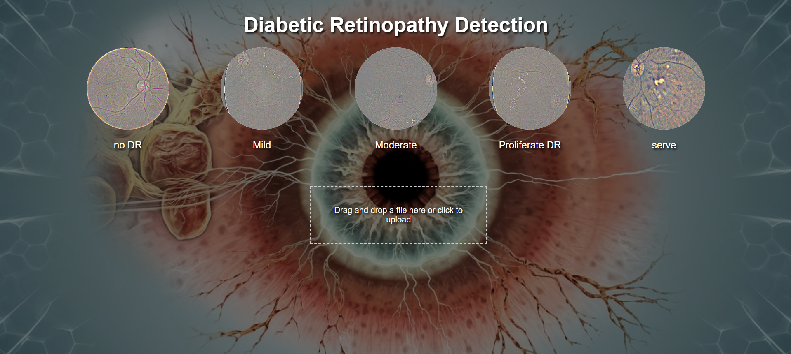
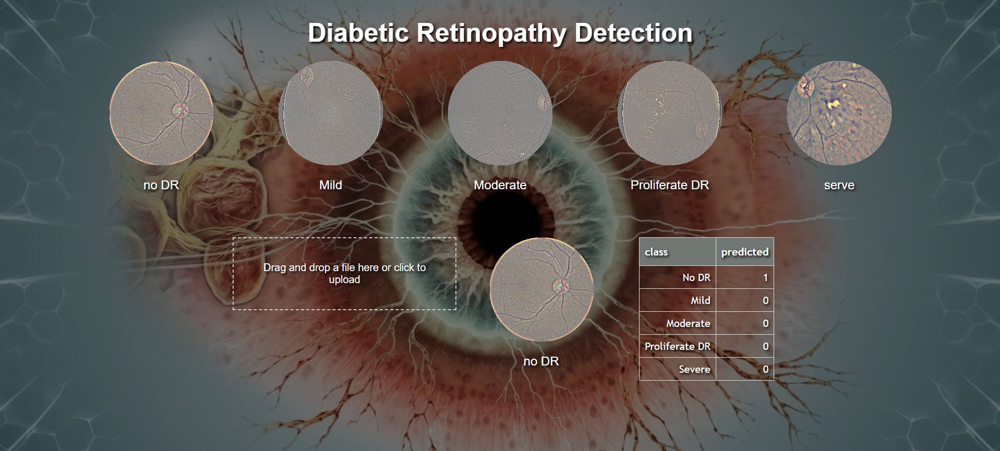

# Diabetic Retinopathy Detection Application

This application detects diabetic retinopathy in retinal images using a FastAPI backend and a frontend built with HTML, CSS, and JavaScript. The model is developed using EfficientNet with transfer learning, trained on the [Diabetic Retinopathy 224x224 Gaussian Filtered dataset](https://www.kaggle.com/datasets/sovitrath/diabetic-retinopathy-224x224-gaussian-filtered) from Kaggle.

## Features

- **User-Friendly Interface**: Upload retinal images through a web interface for analysis.
- **Efficient Model**: Utilizes EfficientNet with transfer learning for accurate detection.
- **FastAPI Backend**: High-performance backend handling image processing and classification.
- **Responsive Frontend**: Built with HTML, CSS, and JavaScript for seamless user experience.


*Application Interface*

*Prediction Result*
## Installation

### Local Setup

1. **Clone the Repository**:

   ```bash
   git clone https://github.com/moaoutir/Diabetic-Retinopathy-Detection.git
   cd Diabetic-Retinopathy-Detection
   ```
2. **Create a Virtual Environment**:

- 2.1 **Windows**:
   ```bash
    python -m venv env
    source .env/bin/activate 
   ```

- 2.2 **Linux/MacOS**:
   ```bash
    python3 -m venv .env  
    source .env/bin/activate  
   ```   

3. **Install Dependencies**:
   ```bash
   pip install -r requirements.txt
   ```   

4. **Run the Application**:
   ```bash
   uvicorn app:app
   ```   
### Using Docker
1. **Clone the Repository**:

   ```bash
   git clone https://github.com/moaoutir/Diabetic-Retinopathy-Detection.git
   cd Diabetic-Retinopathy-Detection
   ```
2. **Build the Docker image**:
   ```bash
    docker build -t retinopathy-detection-app .
   ```
2. **Run the Docker container**:
   ```bash
    docker run -p 8000:8000 retinopathy-detection-app
   ```   


## Usage
- 1- Navigate to the application in your browser.
- 2- Upload a retinal image for analysis.
- 3- View the prediction results displayed on the interface.